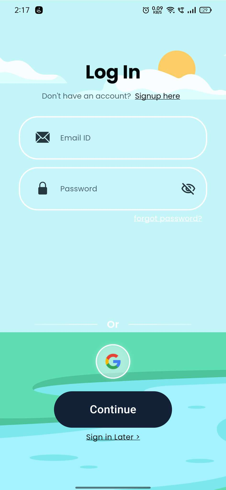
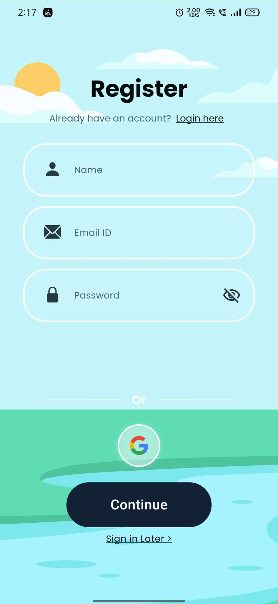
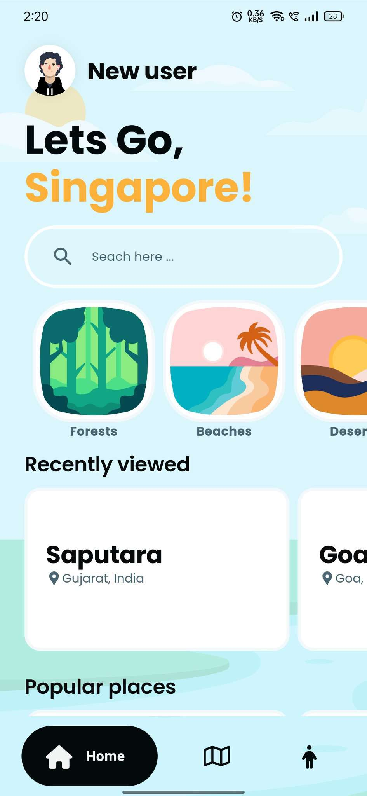
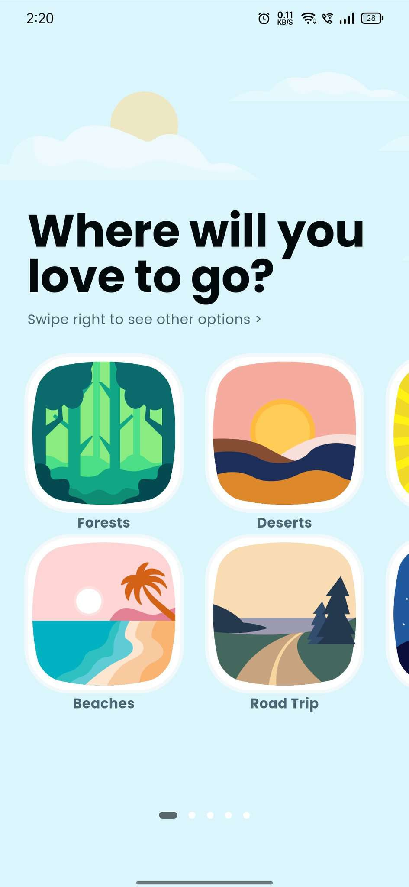
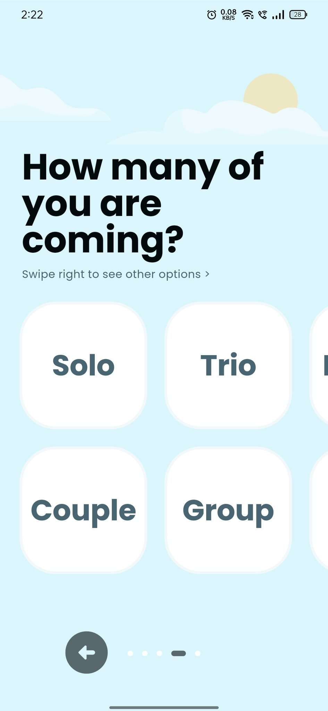
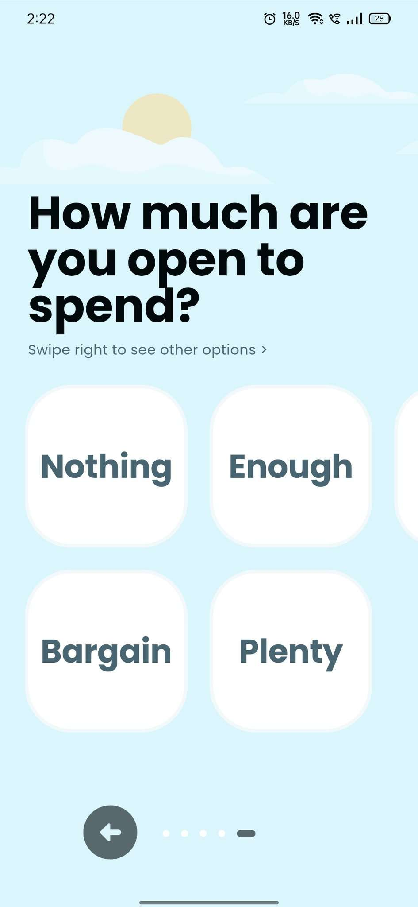
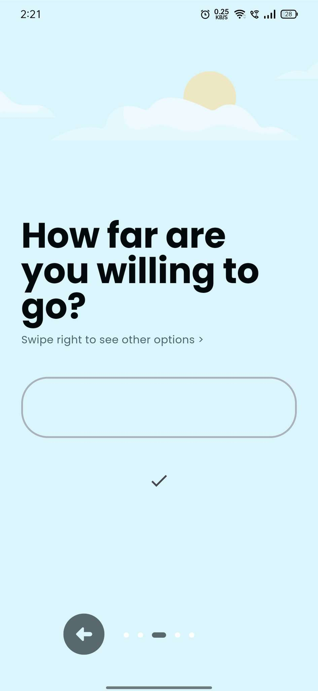

<a name="readme-top"></a>


<!--
[![Contributors][contributors-shield]][contributors-url]
[![Forks][forks-shield]][forks-url]
[![Stargazers][stars-shield]][stars-url]
[![Issues][issues-shield]][issues-url]
[![MIT License][license-shield]][license-url]
[![LinkedIn][linkedin-shield]][linkedin-url]

-->


<!-- PROJECT LOGO -->
<br />
<div align="center">

  <a href="https://github.com/OraclYT/mark-3-demo">
    
  </a> 


<h1 align="center">Way to Go</h1>

  
<!-- ABOUT THE PROJECT -->
## About The Project

<a href="https://github.com/OraclYT/mark-3-demo">
    
  </a> 
  <a href="https://github.com/OraclYT/mark-3-demo">
    
  </a> 
  <a href="https://github.com/OraclYT/mark-3-demo">
    
  </a>
  <a href="https://github.com/OraclYT/mark-3-demo">
    
  </a>
  <a href="https://github.com/OraclYT/mark-3-demo">
    
  </a> 
  <a href="https://github.com/OraclYT/mark-3-demo">
    
  </a> 
  <a href="https://github.com/OraclYT/mark-3-demo">
    
  </a>
  <a href="https://github.com/OraclYT/mark-3-demo">
    
  </a>
  
<p align="right">(<a href="#readme-top">back to top</a>)</p>


### Built With

[![flutter][flutter.js]][Next-url]<br>
[](Next-url)<br>
[](Next-url)
<!--
* [![React][React.js]][React-url]
* [![Vue][Vue.js]][Vue-url]
* [![Angular][Angular.io]][Angular-url]
* [![Svelte][Svelte.dev]][Svelte-url]
* [![Laravel][Laravel.com]][Laravel-url]
* [![Bootstrap][Bootstrap.com]][Bootstrap-url]
* [![JQuery][JQuery.com]][JQuery-url]
-->
<p align="right">(<a href="#readme-top">back to top</a>)</p>


<!-- GETTING STARTED -->
## Getting Started

Darshan Yog Journey is an immersive Flutter-based mobile application that invites users to embark on a spiritual journey through a serene virtual sanctuary. Within this app, users will guide a yog character through various meditative challenges and yoga practices, fostering inner peace and self-discovery along the way.

The essence of Darshan Yog Journey lies in its utilization of a block-based programming system, akin to yoga asanas, to navigate the character through tranquil landscapes and mindfulness exercises. Through intuitive drag-and-drop actions, users will seamlessly orchestrate the yog movements, mirroring the flow of energy and focus in real-life yoga practice.

Powered by Firebase, Darshan Yog Journey offers a seamless integration of user progress and community engagement. Users can store their meditation milestones, track their spiritual growth, and connect with fellow practitioners for shared insights and encouragement, creating a supportive ecosystem for personal development.

With Darshan Yog Journey, users can cultivate a deeper connection with themselves and the universe, fostering harmony between mind, body, and spirit through the transformative power of yoga and meditation.

### Features

1. `knowledge`: This feature provides access to a repository of information on various topics. It includes articles, explanations, and answers to frequently asked questions. 
 
2. `Schedules`:  The Schedules feature helps users organize their time by allowing them to create, manage, and track schedules for various activities or events.
 
3. `Gallery`: The Gallery feature provides a platform for users to upload, view, and share images or multimedia content.
 
4. `Activities`:  Activities feature offers users opportunities to engage in various tasks, challenges, or events either individually or collaboratively.
 
5. `News`:  The News feature delivers timely updates on current events, trends, and developments from around the world.
 
6. `Branches`: The Branches feature provides information about physical locations or branches of a business, organization, or institution.

<!--
### Installation

1. Get a free API Key at [https://example.com](https://example.com)
2. Clone the repo
   ```sh
   git clone https://github.com/github_username/repo_name.git
   ```
3. Install NPM packages
   ```sh
   npm install
   ```
4. Enter your API in `config.js`
   ```js
   const API_KEY = 'ENTER YOUR API';
   ```
-->
<p align="right">(<a href="#readme-top">back to top</a>)</p>


## Target Audience

Way To Go" is meticulously crafted for individuals intrigued by personal growth and self-improvement, offering an immersive digital sanctuary powered by cutting-edge technology. Geared towards those seeking to embark on a journey of self-discovery, this application provides a captivating platform to initiate and nurture personal development.

Ideal for students, professionals, and anyone with a curiosity for self-improvement, "Way To Go" serves as a guiding light on the path to a more fulfilling life. It offers a gateway to mindfulness and tranquility, fostering engagement and skill development in the realm of personal growth.

By amalgamating the allure of virtual exploration with mindfulness challenges and personal development exercises, "Way To Go" endeavors to ignite a passion for self-discovery and holistic well-being. Through this unique blend, users embark on a transformative journey to unlock their full potential, catering to the aspirations of those seeking a more balanced and purposeful life.
<p align="right">(<a href="#readme-top">back to top</a>)</p>


<!-- CONTACT -->
## Contact

Prakash Patel - [@linkedin](https://www.linkedin.com/in/prakash-patell/) - patelprakash8087@gmail.com


### !NO SOURCE CODE(CAN BE USED BY OTHERS IF DECLARED)

<p align="right">(<a href="#readme-top">back to top</a>)</p>


<!-- MARKDOWN LINKS & IMAGES -->
<!-- https://www.markdownguide.org/basic-syntax/#reference-style-links -->
[contributors-shield]: https://img.shields.io/github/contributors/github_username/repo_name.svg?style=for-the-badge
[contributors-url]: https://github.com/github_username/repo_name/graphs/contributors
[forks-shield]: https://img.shields.io/github/forks/github_username/repo_name.svg?style=for-the-badge
[forks-url]: https://github.com/github_username/repo_name/network/members
[stars-shield]: https://img.shields.io/github/stars/github_username/repo_name.svg?style=for-the-badge
[stars-url]: https://github.com/github_username/repo_name/stargazers
[issues-shield]: https://img.shields.io/github/issues/github_username/repo_name.svg?style=for-the-badge
[issues-url]: https://github.com/github_username/repo_name/issues
[license-shield]: https://img.shields.io/github/license/github_username/repo_name.svg?style=for-the-badge
[license-url]: https://github.com/github_username/repo_name/blob/master/LICENSE.txt
[linkedin-shield]: https://img.shields.io/badge/-LinkedIn-black.svg?style=for-the-badge&logo=linkedin&colorB=555
[linkedin-url]: https://linkedin.com/in/linkedin_username
[product-screenshot]: images/ss1.png
[product-screenshot-2]: images/ss2.png
[flutter.js]: https://img.shields.io/badge/flutter-20232A?style=for-the-badge&logo=flutter&logoColor=61DAFB
[unity.js]: https://img.shields.io/badge/unity%203D-000000?style=for-the-badge&logo=unity&logoColor=white
[Next-url]: https://nextjs.org/
[React.js]: https://img.shields.io/badge/React-20232A?style=for-the-badge&logo=react&logoColor=61DAFB
[React-url]: https://reactjs.org/
[Vue.js]: https://img.shields.io/badge/Vue.js-35495E?style=for-the-badge&logo=vuedotjs&logoColor=4FC08D
[C.js]: https://img.shields.io/badge/c%20sharp-000000?style=for-the-badge&logo=c&logoColor=4FC08D
[Vue-url]: https://vuejs.org/
[Angular.io]: https://img.shields.io/badge/Angular-DD0031?style=for-the-badge&logo=angular&logoColor=white
[Angular-url]: https://angular.io/
[Svelte.dev]: https://img.shields.io/badge/Svelte-4A4A55?style=for-the-badge&logo=svelte&logoColor=FF3E00
[Svelte-url]: https://svelte.dev/
[Laravel.com]: https://img.shields.io/badge/Laravel-FF2D20?style=for-the-badge&logo=laravel&logoColor=white
[Laravel-url]: https://laravel.com
[Bootstrap.com]: https://img.shields.io/badge/Bootstrap-563D7C?style=for-the-badge&logo=bootstrap&logoColor=white
[Bootstrap-url]: https://getbootstrap.com
[JQuery.com]: https://img.shields.io/badge/jQuery-0769AD?style=for-the-badge&logo=jquery&logoColor=white
[JQuery-url]: https://jquery.com 
